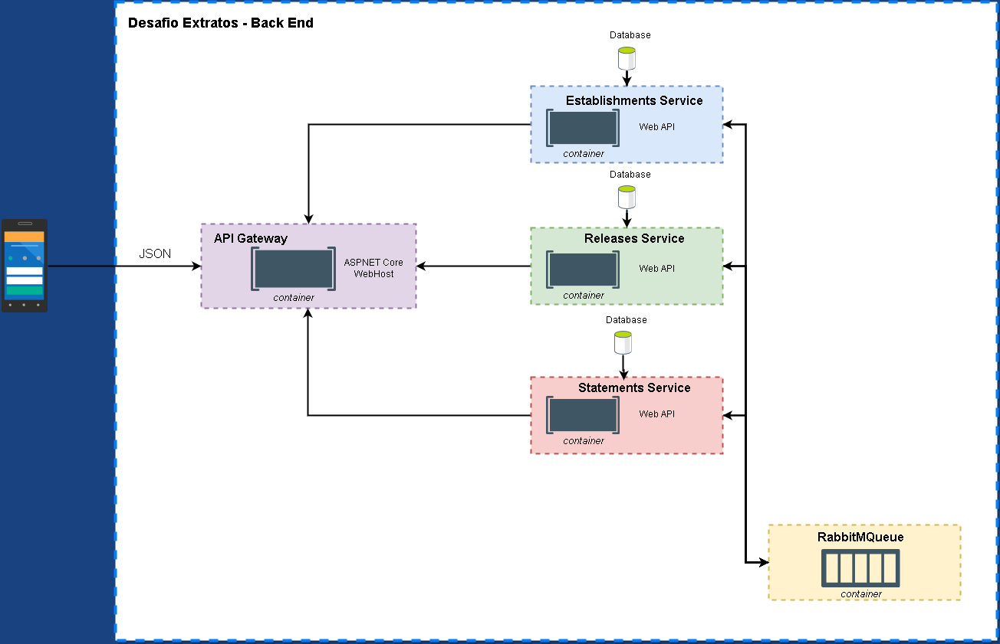

<html>
    <head></head>
    <body>
        <h1>Desafio Extratos - Arquitetura de Microserviços</h1>
        <h2>- Badges</h2>
        

            
           
        

        <h2 vspace=5px>- Considerações</h2>
        <ul>
            <li>As APIs estão hospedadas na Google Cloud Engine e documentada com Swagger. <a href="http://35.223.40.241/swagger/index.html">Acesse aqui</a> ou clique na badge do Heroku do topo do README;</li>
            <li>A consolidação dos resultados e o teste de carga podem ser acessados<a href="https://extratos-resultados-app.herokuapp.com/"> aqui</a> ;</li>
            <li>A hospedagem no Google Cloud não possui configuração de SSL e está sem DNS, pode ser necessário desabilitar as restrições de segurança no browser;</li>
            <li>O backend está baseado em 5 containers dockers. O container da API Gateway serve como um Facade para os microserviços. Os containers dos microserviços são independentes e se comunicam através de um serviço de mensageria, no caso o RabbitMQ, que corresponde ao último container;</li>
            <li>A comunicação através do RabbitMQ é baseado no Design Pattern Observer, quando uma operação ocorre em algum microserviço, ele notificada todos os microserviços que se increveram para serem notificados sobre a determinada ação ocorrida;</li>
            <li>A arquitetura completa pode ser vista na próxima seção;</li>
            <li>Os demais elementos não mudam em relação a implementação passada</li>
        </ul>
        <h2 vspace=5px>- Arquitetura</h2>
        

            
        

        <h2 vspace=5px>- Executando Localmente</h2>
        <ol>
            <li> Clone o repositório;</li>
            <li> No diretório do repositório execute: <i>docker-compose up -d ;</i></li>
            <li> A API Gateway está sendo executada na porta 80 da máquina host, as requisições podem ser feitas no endereço <i>http://localhost/ ;</i></li>
        </ol>
    </body>